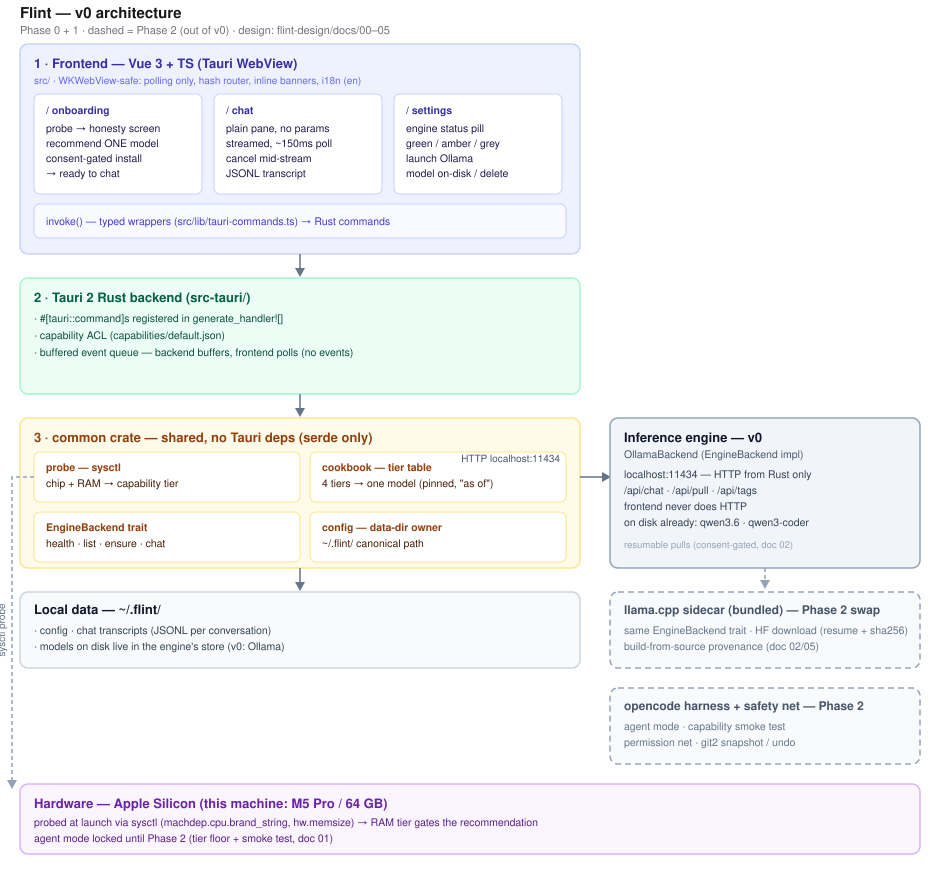

# Flint

A standalone macOS app that gives a non-technical user working local AI with zero
dev-tool gates. It probes the machine's hardware, recommends **one** model that fits
(the "cookbook"), installs it on consent, and offers a plain **chat** — all local, no
cloud, no vendor. Its reason to exist is **vendor resilience** (a single-point-of-failure
hedge must be independent of any vendor's cloud). Design docs: `../flint-design/`
(`STATE.md` → `PLAN.md` → `docs/00`–`05`).

**Status: v0 (Phases 0–2)** — probe + cookbook + engine + install + chat + **agent mode with
a safety net** are shipped. The app probes the hardware, recommends one model, installs it on
consent, chats with it (streamed, persisted), and — on capable hardware — runs an agent in a
folder you choose, asking permission for every action and offering snapshot restore.
Phase 3 (packaging/signing + standalone llama.cpp engine) is next.

## Architecture



The Vue frontend (in a WKWebView) talks to the Tauri Rust backend over typed `invoke()`
wrappers, polling for state rather than listening for events. Shared logic lives in the
`common` crate — hardware probe, cookbook tier table, and the `EngineBackend` trait, which
v0 satisfies with **Ollama** (localhost only; the frontend never does HTTP). Local data
lives under `~/.flint/`. Dashed boxes are Phase 2 (agent mode, llama.cpp sidecar).

## Stack

- **Tauri v2** — desktop shell; Rust backend (`src-tauri/`).
- **Vue 3 + TypeScript** — `<script setup>` SFCs (`src/`).
- **Vite + Deno** — bundler + JS toolchain (`deno.json` tasks; deps in `package.json`,
  installed with `deno install`).
- **Tailwind CSS v4** — via `@tailwindcss/vite`.
- **vue-router v4** — hash history (WKWebView-safe).
- **vue-i18n** — all chrome strings in the `en` catalog (i18n-ready from day 1).

## Commands

```bash
deno install            # install npm deps into node_modules
deno task tauri dev     # run the full desktop app — primary dev loop
deno task dev           # Vite frontend only (no Rust; `invoke` calls will fail)
deno task build         # type-check (vue-tsc) + build frontend to dist/
deno task tauri build   # produce a distributable native binary/installer (unsigned in v0)
cargo build --workspace # build the Rust workspace (common + src-tauri)
cargo test -p common    # shared-crate unit tests
```

## Structure

- `common/` — shared no-Tauri crate: canonical data-dir owner (`~/.flint/`), error type,
  and (from Phase 0) the hardware probe, cookbook tier table, and engine backend trait.
- `src-tauri/` — Tauri app backend (commands + plugins; `main.rs` is a thin shim).
- `src/` — Vue frontend (`main.ts`, `App.vue`, `router.ts`, `i18n.ts`, `views/`, `lib/`,
  `composables/`).

See `CLAUDE.md` for the Tauri bridge pattern, the Deno toolchain rules, and the binding
WKWebView rules.
